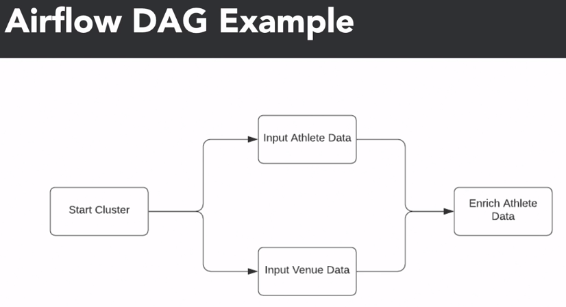

# Data Engineering Foundations

---

## Introduction

### Challenges in a Data-Driven Organization

- Data is scattered
- Slow and blunt analyses due to inefficient data storage
- Legacy code corrupting files
- Manual and repetitive tasks that slow you down

### The Role of a Data Engineer

- Gather data from different sources
- Optimize databases or analyses
- Remove corrupt files and repair the data pipeline
- Automate taskss and pipelines that store data in suitable format
- Definition:
  - A type of software engineering that focuses on designing, developing, testing and maintaining architectures, such as databases and large-scale processing systems

### Data Engineer x Data Scientist

| Data Engineer                                   | Data Scientist                          |
| ----------------------------------------------- | --------------------------------------- |
| Develop robust and scalable data architecture   | Mine data for patterns                  |
| Streamline data collection and storage          | Model using statistics                  |
| Clean corrupt data                              | Clean outliers                          |
| Comprehend cloud technology                     | Comprehend predictive modeling using ML |
| Maintain processes for coherent data management | Monitor business process and metrics    |

### Tooling

- Storage (Databases)
  - Relational x non-relational
- Processing Frameworks
  - Data cleaning
  - Data aggregation
  - Data clustering
  - Batch and stream processing
  - Examples:
    - Spark
    - Hive
    - Flink
    - Kafka
- Automation: Scheduling
  - Set up and manage workflows
  - Plan jobs with specific intervals
  - Resolve dependency requirements of jobs
  - Examples: - Airflow - Oozie - Luigi
    

---

## Databases and Dataframes

### Types


### Database Schema


### Star Schema


### Distributed computing


- Benefits:
  - More processing power
  - More scalable
  - Cost effective
  - Fault tolerance
- Risks:
  - Overhead due to commnication between nodes
  - Task needs to be large
  - Needs several processing units
- Example:
  

```python
from multiprocessing import Pool

def athlete_avg_age(grouped_data):
    year, group = grouped_data
    return pd.DataFrame({"Age": group["Age"].mean()}, index = [year])

with Pool(4) as p:
    average_age = p.map(athlete_avg_age, df.groupby("Year"))
```

---

## Data Engineering Tools

### MapReduce and Hadoop

- Hadoop
  - Framework for distributed processing of large data sets across clusters of computers
  - Collection of open-source projects (Apache)
  - Uses the MapReduce algorithm
  - Playes a central role in ETL processing
- Hadoop DFS
  - Distributed file system
  - Files reside on different computers
  - Essential part of the big data ecosystem
  - Replaced by cloud-managed storage services such as S3
- Hadoop MapReduce
  

### Hive

- Data warehouse software project
- Built on top of Hadoop
- Hive SQL
- Gives an SQL-like interface to query data
- Data extraction from databases and file systems that integrate with Hadoop
- Earlier, queries had to be implemented in MapReduce Java API
  

### Spark

- Distributes data processing tasks between clusters
- Processing is done in memory
- Faster processing as it avoids disk writes
- It relies on Resilient Distributed Datasets (RDDs)
- RDDs:
  - Data structure that maintains data across multiple nodes
  - Immatable (read-only), partitioned collection of elements
  - Tracks data lineage information to recover lost data
  - Supports two types of operations:
    - Transformations
      - `filter()`
      - `map()`
      - `groupByKey()`
      - `union()`
    - Actions
      - `count()`
      - `first()`
      - `collect()`
      - `reduce()`
- PySpark:
  - Python APIP for Spark
  - DataFrame abstraction
  - Similar to pandas
    

### Airflow


- Linux cron
- Spotify's Luigi
- Apache Airflow
  - Tool for describing, executing and monitoring workflows or pipelines
  - Based on DAGs
  - Written in Python





---

## ETL Pipelines

### Sources


