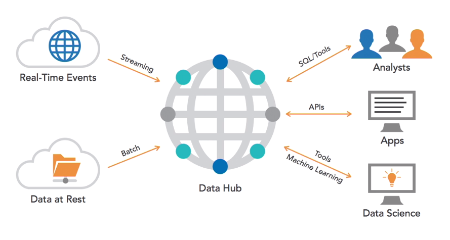
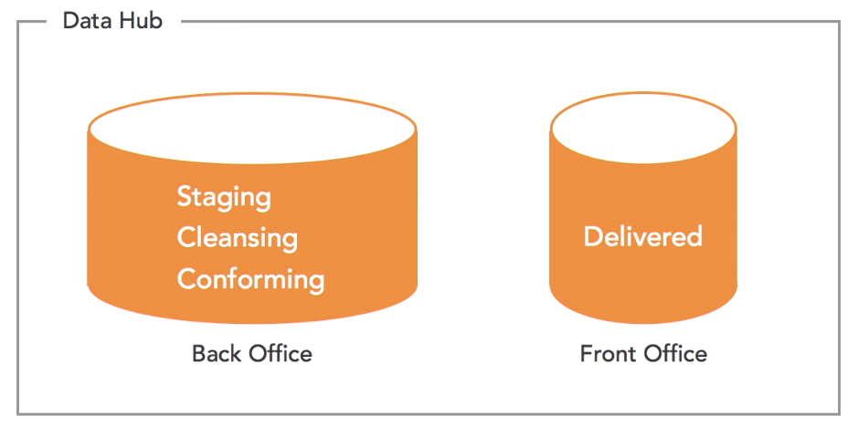
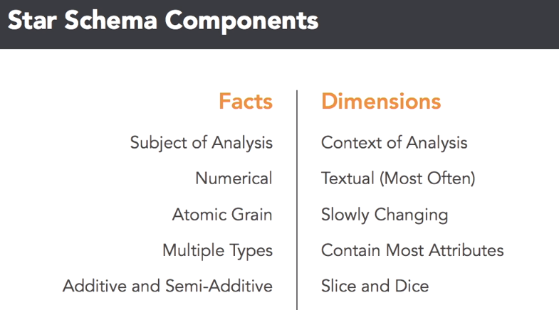
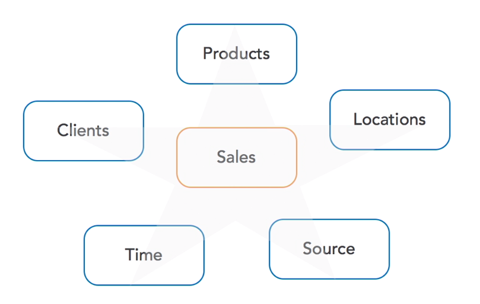
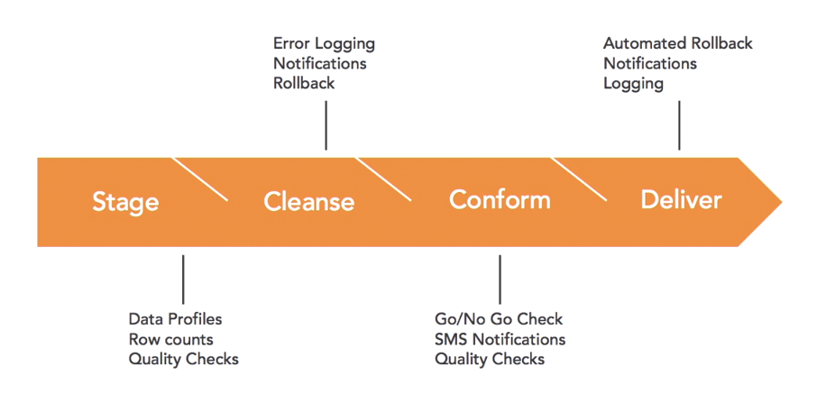

# Data Science Foundations: Data Engineering

## Ecosystem Overview

### System Overview

- `Staging`: persisting data as we receive
- `Cleansing`: transformations (datetime), removing nulls
- `Conforming`: getting references in base tables, ids
- `Delivered`: UPSERT (update or insert)

### Star schema

- Star Schema: Sales `Facts` are just 1 join away of all support `Dimensions` information

### Data Engineering Responsabilities

- Data Ops Tasks
  - Infra
  - Availability/Performance
- Data Prep
  - Staging
  - Cleansing
  - Conforming
  - Deliverying
- Data Interfaces
  - APIs
  - Query Tool Compatibility

### Good data pipeline

